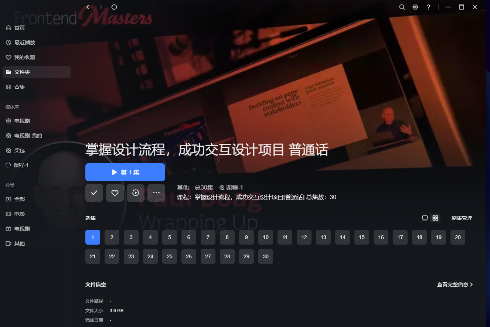

# 课程NFO管理器 | Course NFO Manager

<div align="center">

[English](README_EN.md) | [简体中文](README.md) | [繁體中文](README_ZH_TW.md) | [日本語](README_JA.md) | [Español](README_ES.md) | [Deutsch](README_DE.md)

[](LICENSE)
[](https://www.python.org/)
[](https://github.com/your-username/course-nfo-manager/stargazers)
[](https://github.com/your-username/course-nfo-manager/actions)

</div>

## 📖 项目介绍

课程NFO管理器是一个专门用于管理和生成在线课程NFO文件的强大工具。它能够帮助您组织和管理课程媒体库，解决普通媒体库自动生成的课程排序混乱问题。

### 主要特性

- 🚀 支持批量生成和编辑NFO文件
- 🖼️ 智能管理课程海报
- 📁 支持多层目录结构
- 🏷️ 智能标签管理系统
- 🔄 自动继承父目录标签
- ⚡ 高效的批量处理能力
- 📚 **Single文件课程管理** - 简化课程结构，一键生成NFO

### 兼容性

- ✅ 完全支持绿联NAS影视中心
- 🌟 理论上支持所有媒体库管理软件

## 🎯 Single文件课程功能（推荐新手使用）

Single文件课程功能是专为简化课程管理而设计的全新功能。通过在每个课程根目录放置一个`single`文件，即可快速识别和管理课程，无需复杂的语言目录结构。

### ✨ 功能特点

- **极简结构**：只需在课程根目录放置一个`single`文件
- **自动识别**：程序自动扫描并识别包含`single`文件的课程目录
- **一键生成**：批量生成所有课程的NFO文件
- **独立运行**：完全独立的功能模块，不影响其他标签页
- **海报支持**：支持在课程根目录放置`poster.jpg`作为课程海报

### 📂 Single文件课程目录结构

```
课程名称/
├── single                    # 课程标识文件（无后缀）
├── poster.jpg               # 课程海报（可选）
├── 第1章/
│   ├── 1.1课程.mp4
│   └── 1.2课程.mp4
├── 第2章/
│   ├── 2.1课程.mp4
│   └── 2.2课程.mp4
└── 其他视频文件.mp4
```

**single文件说明**：
- 文件名：`single`（无后缀）或 `single.txt`、`single.any`（任意后缀）
- 位置：课程根目录
- 作用：标识该目录为课程目录

### 🚀 使用步骤

1. **准备课程目录**：
   - 将课程视频按章节组织到目录中
   - 在课程根目录放置一个`single`文件

2. **启动程序**：
   ```bash
   python main.py
   ```

3. **使用Single文件课程功能**：
   - 点击"Single文件课程"标签页（第一个标签页）
   - 点击"选择目录"按钮，选择包含课程的主目录
   - 点击"开始扫描"按钮，程序会自动找到所有包含`single`文件的课程
   - 查看扫描结果，确认课程信息
   - 点击"生成NFO文件"按钮，批量生成所有课程的NFO文件

4. **查看结果**：
   - 程序会在每个课程根目录生成`tvshow.nfo`文件
   - 为每个视频文件生成对应的`.nfo`文件

### 📋 示例展示

Single文件课程功能支持多种目录结构，以下是各种结构类型的示例：

#### 1. 一级结构（仅根目录有视频）

适用于简单的课程，所有视频文件直接放在课程根目录：

```
我的课程库/
└── Python基础教程/
    ├── single
    ├── poster.jpg          # 课程海报
    ├── 1-课程介绍.mp4
    ├── 2-环境搭建.mp4
    ├── 3-语法基础.mp4
    └── 4-实战练习.mp4
```

**扫描结果**：
- 找到1个Single文件课程
- Python基础教程（4个视频）

**生成结果**：
- 根目录生成`tvshow.nfo`
- 每个视频文件生成对应的`.nfo`文件

#### 2. 二级结构（仅二级目录有视频）

适用于按章节组织的课程，视频文件按章节分类存放：

```
我的课程库/
├── Python编程入门/
│   ├── single
│   ├── poster.jpg          # 课程海报
│   ├── 第1章-基础语法/
│   │   ├── 1.1变量和数据类型.mp4
│   │   └── 1.2控制流程.mp4
│   └── 第2章-函数和模块/
│       ├── 2.1函数定义.mp4
│       └── 2.2模块导入.mp4
└── JavaScript进阶/
    ├── single.txt
    ├── poster.jpg          # 课程海报
    ├── 第1章-ES6特性/
    │   ├── 1.1箭头函数.mp4
    │   └── 1.2解构赋值.mp4
    └── 第2章-异步编程/
        ├── 2.1Promise.mp4
        └── 2.2async_await.mp4
```

**扫描结果**：
- 找到2个Single文件课程
- Python编程入门（4个视频）
- JavaScript进阶（4个视频）

#### 3. 三级结构（三级目录有视频）

适用于复杂的课程，大章节下包含多个小章节：

```
我的课程库/
└── 完整Web开发课程/
    ├── single
    ├── poster.jpg          # 课程海报
    ├── 第一部分-前端开发/
    │   ├── 第1章-HTML基础/
    │   │   ├── 1.1HTML语法.mp4
    │   │   └── 1.2标签使用.mp4
    │   └── 第2章-CSS样式/
    │       ├── 2.1CSS基础.mp4
    │       └── 2.2布局技巧.mp4
    └── 第二部分-后端开发/
        ├── 第3章-Node.js/
        │   ├── 3.1环境搭建.mp4
        │   └── 3.2基础语法.mp4
        └── 第4章-数据库/
            ├── 4.1MySQL基础.mp4
            └── 4.2数据操作.mp4
```

**扫描结果**：
- 找到1个Single文件课程
- 完整Web开发课程（8个视频）

#### 4. 混合结构（根目录视频 + 二级目录视频）

适用于既有介绍视频又有章节内容的课程，**根目录视频序号在前**：

```
我的课程库/
└── 机器学习实战/
    ├── single
    ├── poster.jpg          # 课程海报
    ├── 0-课程介绍.mp4          # 根目录视频，序号在前
    ├── 0-学习路线.mp4          # 根目录视频，序号在前
    ├── 第1章-基础理论/
    │   ├── 1.1数学基础.mp4
    │   └── 1.2算法原理.mp4
    └── 第2章-实战项目/
        ├── 2.1数据预处理.mp4
        └── 2.2模型训练.mp4
```

**扫描结果**：
- 找到1个Single文件课程
- 机器学习实战（6个视频）

**视频排序**：
1. 0-课程介绍.mp4（根目录视频，序号1）
2. 0-学习路线.mp4（根目录视频，序号2）
3. 1.1数学基础.mp4（第1章视频，序号3）
4. 1.2算法原理.mp4（第1章视频，序号4）
5. 2.1数据预处理.mp4（第2章视频，序号5）
6. 2.2模型训练.mp4（第2章视频，序号6）

**生成结果**：
- 根目录生成`tvshow.nfo`
- 每个视频文件生成对应的`.nfo`文件
- 根目录视频作为"根目录"章节
- 二级目录视频按目录名组织章节

### ⚠️ Single文件课程注意事项

1. **single文件要求**：
   - 文件名必须是`single`（无后缀）或`single.*`（任意后缀）
   - 必须放在课程根目录
   - 每个课程目录只需要一个`single`文件

2. **海报文件支持**：
   - 支持在课程根目录放置`poster.jpg`作为课程海报
   - 海报文件名必须是`poster.jpg`
   - 海报文件与`single`文件在同一目录
   - 推荐海报尺寸：1080x1920（竖版海报）

3. **目录结构建议**：
   - 支持1级、2级、3级目录结构
   - **支持混合结构**：根目录视频 + 二级目录视频
   - 视频文件可以是`.mp4`、`.mkv`、`.avi`格式
   - 建议使用数字编号的章节名称
   - 混合结构中，根目录视频序号会自动排在前面

3. **NFO文件生成**：
   - `tvshow.nfo`会在课程根目录生成
   - 视频NFO文件会在视频文件同目录生成
   - 默认会覆盖已存在的NFO文件

4. **与其他功能的区别**：
   - Single文件课程功能完全独立
   - 不需要"普通话Deepl"或"原"子目录
   - 生成的NFO文件标记为"课程"类型
   - **混合结构特殊说明**：
     - 根目录视频会作为"根目录"章节
     - 根目录视频的全局序号会排在前面
     - 二级目录视频按目录名排序

## ��️ 技术要求

- Python 3.8+
- 操作系统：Windows/Linux/macOS

## 📥 安装指南

### 方式一：直接下载使用（推荐）

1. 从 [Releases](https://github.com/your-username/course-nfo-manager/releases) 页面下载适合您系统的最新版本：
   - Windows: `course-nfo-manager-windows.exe`
   - macOS: `course-nfo-manager-macos`
   - Linux: `course-nfo-manager-linux`
2. 运行下载的可执行文件

### 方式二：从源码安装

```bash
# 1. 克隆仓库
git clone https://github.com/your-username/course-nfo-manager.git
cd course-nfo-manager

# 2. 安装 Poetry（如果尚未安装）
pip install poetry

# 3. 安装依赖
poetry install

# 4. 运行程序
poetry run course-nfo-manager
```

## 🚀 快速开始

```bash
# 运行程序
python main.py
```

## 📂 目录结构规范

课程目录需要遵循以下结构：

```
课程名称[语言标识]
├── 普通话Deepl/          # 中文课程目录
│   ├── 第1章/
│   │   ├── 1.1课程.mp4
│   │   └── 1.2课程.mp4
│   └── 第2章/
└── 原/                   # 原始语言课程目录
```

### 示例

```
完整的C#大师课程 Complete C# Masterclass[普通话]
├── 普通话Deepl
│   ├── 1 - 你的第一个 C 程序与 Visual Studio 概述
│   │   ├── 1 - 引言.mp4
│   │   └── 2 - 你想达成什么.mp4
│   └── 2 - 数据类型和变量
│       ├── 20 - 更多数据类型及其限制.mp4
│       └── 22 - 数据类型：整型、浮点型与双精度型.mp4
└── 原
```

## 💡 功能详解

### 1. NFO生成器
- 多层目录结构识别
- 智能章节结构分析
- 自动标签继承系统
- 灵活的覆盖选项

### 2. NFO编辑器
- 批量信息编辑
- 海报管理系统
- 自定义标签系统

## 📸 界面预览

<div align="center">
  
  <br/>
  
  <br/>
  
  <br/>
  
</div>

## ⚠️ 注意事项

1. 课程目录命名规范：
   - 中文课程必须放在 `普通话Deepl` 目录下
   - 原始语言课程放在 `原` 目录下
   - NFO文件会自动添加相应的语言后缀（中文课程添加"[普通话]"，原始语言课程添加"[英语]"）
   - 课程目录名称应包含原始语言名称和中文翻译（如果有）

2. .nomedia文件处理：
   - 目前 .nomedia 检测功能处于关闭状态
   - NFO文件将始终在 `原` 目录下生成
   - 不会影响媒体库的正常扫描和识别

3. 文件命名建议：
   - 建议使用阿拉伯数字作为章节编号
   - 避免在文件名中使用特殊字符
   - 保持命名格式的一致性

4. 系统兼容性说明：
   - Windows 用户需要注意文件路径长度限制
   - Linux/macOS 用户注意文件系统大小写敏感性
   - 建议使用 UTF-8 编码保存所有文件

## 🤝 贡献指南

我们欢迎所有形式的贡献，无论是新功能、文档改进还是错误报告。请参考以下步骤：

1. Fork 本仓库
2. 创建新的特性分支 (`git checkout -b feature/AmazingFeature`)
3. 提交更改 (`git commit -m 'Add some AmazingFeature'`)
4. 推送到分支 (`git push origin feature/AmazingFeature`)
5. 开启一个 Pull Request

## 📄 许可证

本项目采用 MIT 许可证 - 查看 [LICENSE](LICENSE) 文件了解详情

## 🌟 致谢

感谢所有为这个项目做出贡献的开发者们！

## 📮 联系方式

如有任何问题或建议，欢迎通过以下方式联系：

- 提交 [Issue](https://github.com/your-username/course-nfo-manager/issues)
- 发送邮件至：[airmusic@msn.com](mailto:airmusic@msn.com)

## 👨‍💻 开发指南

### 环境设置

```bash
# 安装 Poetry
pip install poetry

# 安装依赖
poetry install

# 激活虚拟环境
poetry shell
```

### 构建可执行文件

```bash
# 安装 PyInstaller
pip install pyinstaller

# Windows
pyinstaller --onefile --windowed --icon=docs/icon.ico --name=course-nfo-manager-windows.exe main.py

# macOS
pyinstaller --onefile --windowed --clean --target-arch universal2 --icon=docs/icon.icns --name=course-nfo-manager-macos main.py

# Linux
pyinstaller --onefile --name=course-nfo-manager-linux main.py
```

### 自动化发布

项目使用 GitHub Actions 进行自动化构建和发布。当推送新的版本标签时，将自动触发构建流程：

```bash
# 创建新的版本标签
git tag -a v1.0.0 -m "Release version 1.0.0"

# 推送标签到远程仓库
git push origin v1.0.0
```

这将自动触发构建流程，并在 GitHub Releases 页面创建新的发布版本。

## 🔧 故障排除

### macOS 用户常见问题

#### 问题：显示"未能打开文稿，文本编码Unicode (UTF-8)不适用"

**原因**：macOS可执行文件权限或文件类型识别问题

**解决方案**：
1. **设置执行权限**：
   ```bash
   chmod +x course-nfo-manager-macos
   ```

2. **通过终端运行**：
   ```bash
   ./course-nfo-manager-macos
   ```

3. **检查文件类型**：
   ```bash
   file course-nfo-manager-macos
   ```
   应该显示类似：`course-nfo-manager-macos: Mach-O universal binary`

4. **如果仍有问题，尝试**：
   ```bash
   # 移除隔离属性
   xattr -d com.apple.quarantine course-nfo-manager-macos
   
   # 重新设置权限
   chmod +x course-nfo-manager-macos
   ```

#### 问题：应用无法启动

**解决方案**：
1. 确保文件有执行权限
2. 检查macOS安全设置，允许运行未签名的应用
3. 在系统偏好设置 > 安全性与隐私 > 通用中允许应用运行

### 通用问题

#### 问题：找不到依赖模块

**解决方案**：
1. 确保安装了所有依赖：`pip install -r requirements.txt`
2. 检查Python版本兼容性（需要Python 3.8+）
3. 重新安装依赖：`pip install --upgrade -r requirements.txt`

#### 问题：NFO文件生成失败

**解决方案**：
1. 检查目录权限
2. 确保有写入权限
3. 检查文件路径长度（Windows用户）
4. 确保使用UTF-8编码

---

<div align="center">

如果这个项目对您有帮助，请考虑给它一个 ⭐️

</div>