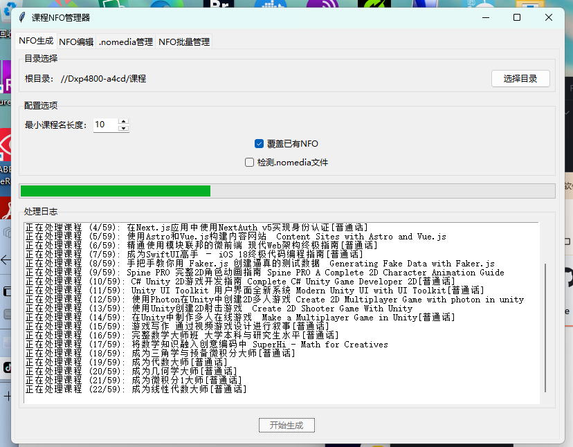

# Kurs-NFO-Manager | Course NFO Manager

<div align="center">

[English](README_EN.md) | [简体中文](README.md) | [繁體中文](README_ZH_TW.md) | [日本語](README_JA.md) | [Español](README_ES.md) | [Deutsch](README_DE.md)

[](LICENSE)
[](https://www.python.org/)
[](https://github.com/your-username/course-nfo-manager/stargazers)

</div>

## 📖 Projektübersicht

Der Kurs-NFO-Manager ist ein leistungsstarkes Tool, das speziell für die Verwaltung und Generierung von NFO-Dateien für Online-Kurse entwickelt wurde. Es hilft Ihnen bei der Organisation und Verwaltung Ihrer Kurs-Medienbibliothek und löst das Problem der chaotischen Kursreihenfolge in regulären Medienbibliotheken.

### Hauptfunktionen

- 🚀 Unterstützung für Batch-Generierung und -Bearbeitung von NFO-Dateien
- 🖼️ Intelligente Verwaltung von Kurspostern
- 📁 Unterstützung für mehrstufige Verzeichnisstruktur
- 🏷️ Intelligentes Tag-Management-System
- 🔄 Automatische Vererbung von Überverzeichnis-Tags
- ⚡ Effiziente Batch-Verarbeitungsfähigkeiten

### Kompatibilität

- ✅ Volle Unterstützung für UGREEN NAS Media Center
- 🌟 Theoretisch kompatibel mit allen Medienbibliothek-Verwaltungsprogrammen

## 🛠️ Technische Anforderungen

- Python 3.6+
- Betriebssysteme: Windows/Linux/macOS

## 📥 Installationsanleitung

### Methode 1: Installation mit pip (Empfohlen)

```bash
# 1. Repository klonen
git clone https://github.com/your-username/course-nfo-manager.git
cd course-nfo-manager

# 2. Virtuelle Umgebung erstellen und aktivieren
python -m venv venv

# Windows
venv\Scripts\activate

# Linux/macOS
source venv/bin/activate

# 3. Abhängigkeiten installieren
pip install -r requirements.txt
```

### Methode 2: Direkter Download

1. Laden Sie die neueste Version von der [Releases](https://github.com/your-username/course-nfo-manager/releases)-Seite herunter
2. Entpacken Sie die Dateien
3. Führen Sie die ausführbare Datei aus

## 🚀 Schnellstart

```bash
# Programm ausführen
python main.py
```

## 📂 Verzeichnisstruktur-Spezifikation

Kursverzeichnisse sollten dieser Struktur folgen:

```
Kursname[Sprachkennung]
├── MandarinDeepl/          # Chinesisches Kursverzeichnis
│   ├── Kapitel1/
│   │   ├── 1.1Lektion.mp4
│   │   └── 1.2Lektion.mp4
│   └── Kapitel2/
└── Original/               # Originalsprachen-Kursverzeichnis
```

### Beispiel

```
Complete C# Masterclass[Mandarin]
├── MandarinDeepl
│   ├── 1 - Dein erstes C#-Programm und Visual Studio Überblick
│   │   ├── 1 - Einführung.mp4
│   │   └── 2 - Was du erreichen willst.mp4
│   └── 2 - Datentypen und Variablen
│       ├── 20 - Weitere Datentypen und ihre Grenzen.mp4
│       └── 22 - Datentypen: Integer, Float und Double.mp4
└── Original
```

## 💡 Detaillierte Funktionen

### 1. NFO-Generator
- Erkennung mehrstufiger Verzeichnisstrukturen
- Intelligente Kapitelstrukturanalyse
- Automatisches Tag-Vererbungssystem
- Flexible Überschreibungsoptionen

### 2. NFO-Editor
- Batch-Informationsbearbeitung
- Poster-Verwaltungssystem
- Benutzerdefiniertes Tag-System

## 📸 Benutzeroberflächen-Vorschau

<div align="center">
  
  <br/>
  
  <br/>
  
  <br/>
  
</div>

## ⚠️ Wichtige Hinweise

1. Kursverzeichnis-Namenskonvention:
   - Chinesische Kurse müssen im Verzeichnis `MandarinDeepl` platziert werden
   - Originalsprachenkurse sollten im Verzeichnis `Original` platziert werden
   - NFO-Dateien werden automatisch mit entsprechenden Sprachsuffixen versehen

2. .nomedia-Dateiverarbeitung:
   - Derzeit ist die .nomedia-Erkennungsfunktion deaktiviert
   - NFO-Dateien werden immer im Verzeichnis `Original` generiert

## 🤝 Beitragsrichtlinien

Wir begrüßen alle Formen von Beiträgen, seien es neue Funktionen, Dokumentationsverbesserungen oder Fehlerberichte. Bitte befolgen Sie diese Schritte:

1. Forken Sie das Repository
2. Erstellen Sie einen Feature-Branch (`git checkout -b feature/TollesFunktion`)
3. Committen Sie Ihre Änderungen (`git commit -m 'Tolle Funktion hinzugefügt'`)
4. Pushen Sie zum Branch (`git push origin feature/TollesFunktion`)
5. Öffnen Sie einen Pull Request

## 📄 Lizenz

Dieses Projekt ist unter der MIT-Lizenz lizenziert - siehe die [LICENSE](LICENSE)-Datei für Details

## 🌟 Danksagungen

Vielen Dank an alle Entwickler, die zu diesem Projekt beigetragen haben!

## 📮 Kontakt

Bei Fragen oder Anregungen können Sie uns gerne kontaktieren über:

- Erstellen Sie ein [Issue](https://github.com/your-username/course-nfo-manager/issues)
- Senden Sie eine E-Mail an: [airmusic@msn.com](mailto:airmusic@msn.com)

---

<div align="center">

Wenn Ihnen dieses Projekt hilft, denken Sie bitte über einen ⭐️ nach

</div> 