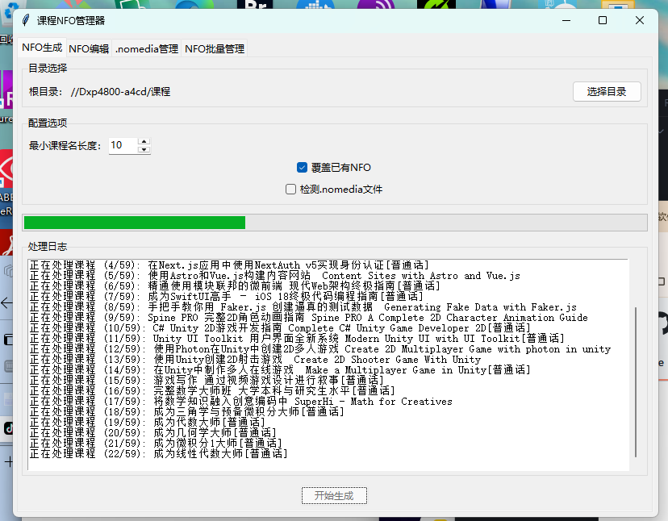
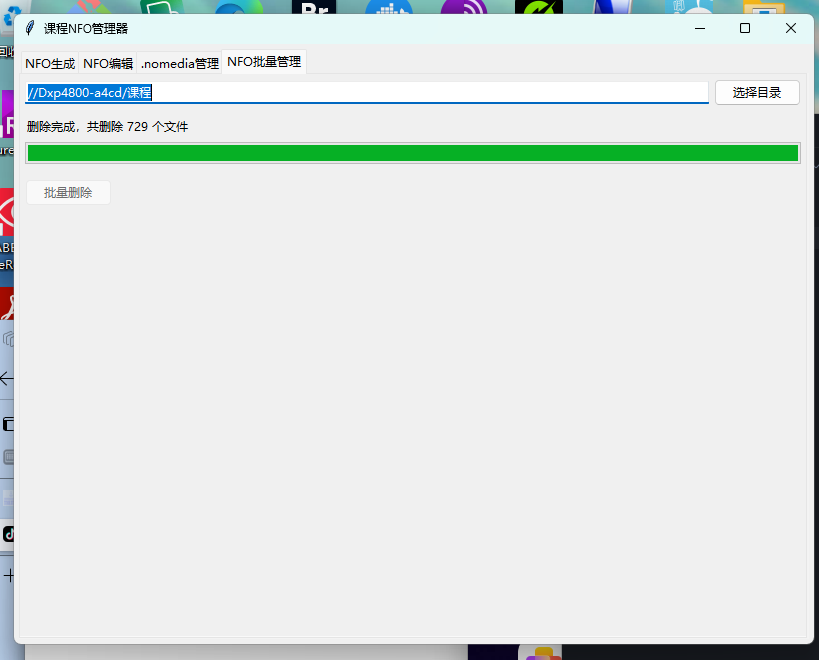
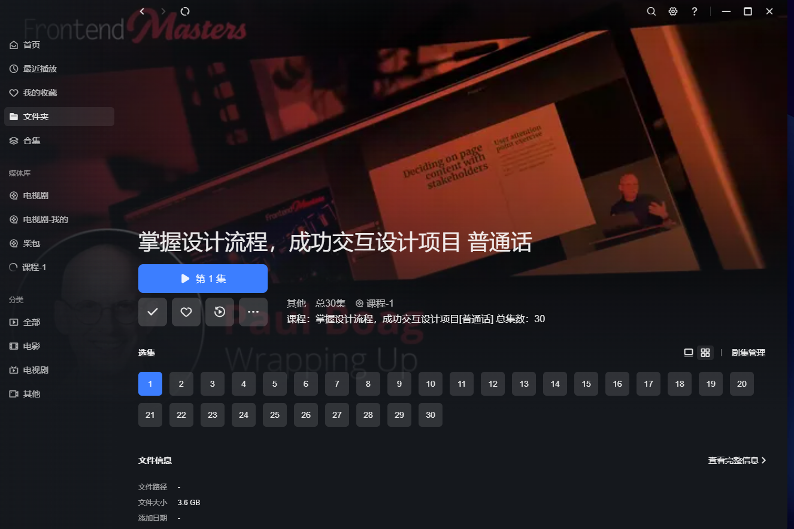
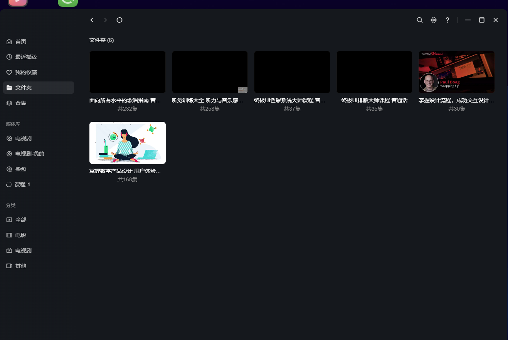

# Course NFO Manager

<div align="center">

[English](README_EN.md) | [简体中文](README.md)

[](LICENSE)
[](https://www.python.org/)
[](https://github.com/your-username/course-nfo-manager/stargazers)

</div>

## 📖 Introduction

Course NFO Manager is a powerful tool designed specifically for managing and generating NFO files for online courses. It helps you organize and manage your course media library, solving the problem of chaotic course ordering in regular media libraries.

### Key Features

- 🚀 Batch generation and editing of NFO files
- 🖼️ Smart course poster management
- 📁 Multi-level directory structure support
- 🏷️ Intelligent tag management system
- 🔄 Automatic parent directory tag inheritance
- ⚡ Efficient batch processing capabilities

### Compatibility

- ✅ Full support for UGREEN NAS Media Center
- 🌟 Theoretically supports all media library management software

## 🛠️ Technical Requirements

- Python 3.6+
- Operating Systems: Windows/Linux/macOS

## 📥 Installation Guide

### Method 1: Using pip (Recommended)

```bash
# 1. Clone the repository
git clone https://github.com/your-username/course-nfo-manager.git
cd course-nfo-manager

# 2. Create and activate virtual environment
python -m venv venv

# Windows
venv\Scripts\activate

# Linux/macOS
source venv/bin/activate

# 3. Install dependencies
pip install -r requirements.txt
```

### Method 2: Direct Download

1. Download the latest version from [Releases](https://github.com/your-username/course-nfo-manager/releases)
2. Extract the files
3. Run the executable

## 🚀 Quick Start

```bash
# Run the program
python main.py
```

## 📂 Directory Structure Specification

Course directories should follow this structure:

```
CourseName[LanguageIdentifier]
├── MandarinDeepl/          # Chinese course directory
│   ├── Chapter1/
│   │   ├── 1.1Lesson.mp4
│   │   └── 1.2Lesson.mp4
│   └── Chapter2/
└── Original/               # Original language course directory
```

### Example

```
Complete C# Masterclass[Mandarin]
├── MandarinDeepl
│   ├── 1 - Your First C# Program and Visual Studio Overview
│   │   ├── 1 - Introduction.mp4
│   │   └── 2 - What You Want to Achieve.mp4
│   └── 2 - Data Types and Variables
│       ├── 20 - More Data Types and Their Limits.mp4
│       └── 22 - Data Types: Integer, Float, and Double.mp4
└── Original
```

## 💡 Detailed Features

### 1. NFO Generator
- Multi-level directory structure recognition
- Intelligent chapter structure analysis
- Automatic tag inheritance system
- Flexible overwrite options

### 2. NFO Editor
- Batch information editing
- Poster management system
- Custom tag system

## 📸 Interface Preview

<div align="center">
  
  <br/>
  
  <br/>
  
  <br/>
  
</div>

## ⚠️ Important Notes

1. Course Directory Naming Convention:
   - Chinese courses must be placed in the `MandarinDeepl` directory
   - Original language courses should be in the `Original` directory
   - NFO files will automatically add corresponding language suffixes

2. .nomedia File Handling:
   - Currently, .nomedia detection feature is disabled
   - NFO files will always be generated in the `Original` directory

## 🤝 Contributing

We welcome all forms of contributions, whether they're new features, documentation improvements, or bug reports. Please follow these steps:

1. Fork the repository
2. Create your feature branch (`git checkout -b feature/AmazingFeature`)
3. Commit your changes (`git commit -m 'Add some AmazingFeature'`)
4. Push to the branch (`git push origin feature/AmazingFeature`)
5. Open a Pull Request

## 📄 License

This project is licensed under the MIT License - see the [LICENSE](LICENSE) file for details

## 🌟 Acknowledgments

Thanks to all the developers who have contributed to this project!

## 📮 Contact

If you have any questions or suggestions, feel free to reach out through:

- Submit an [Issue](https://github.com/your-username/course-nfo-manager/issues)
- Send an email to: [airmusic@msn.com](mailto:airmusic@msn.com)

---

<div align="center">

If this project helps you, please consider giving it a ⭐️

</div> 